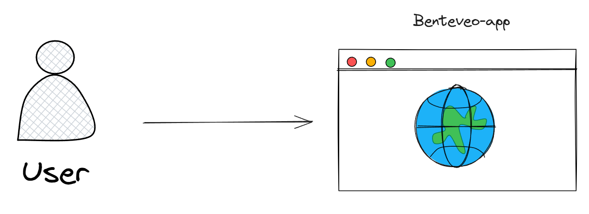
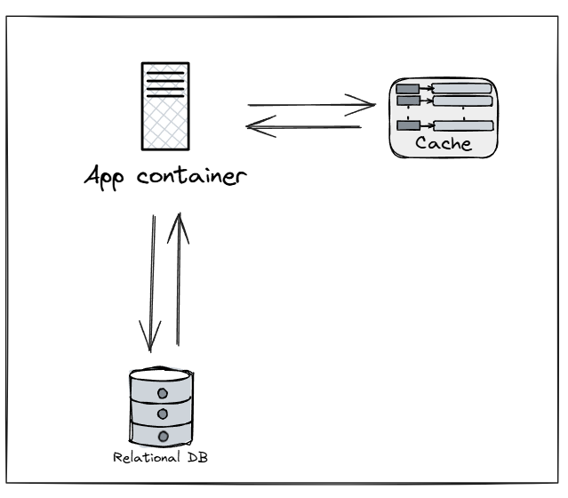
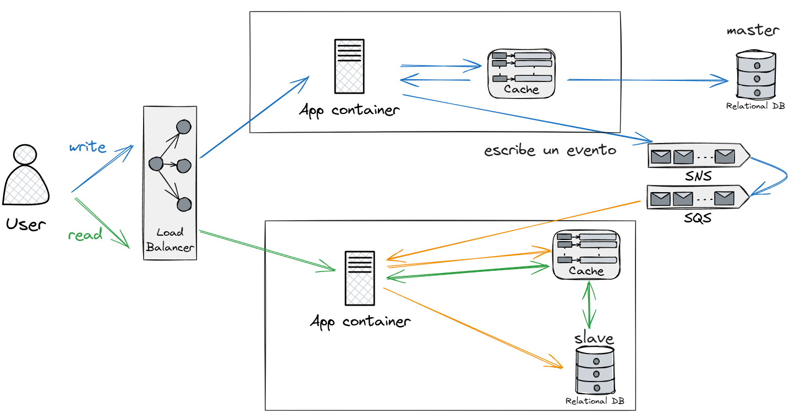

# benteveo-app

### Contexto (System Context Diagram)



La api se ocupa de recibir las peticiones de los usuarios para crear un mensaje de micro-bloogin(tweet), seguir usuarios y consultar los mensajes publicados por otros usuarios. 
Ademas, orquesta la persistencia del mensaje y de propagarlo entre todas las instancias de modo tal de que este disponible en los timelines que necesiten leerlos. 

### Contenedores (Container Diagram)



app-container es el contenedor administra las peticiones.
cache guarda temporalmente los tweets mas recientes para consultas rapidas.
base de datos para la persistencia "en frio" de los tweets.

### Diagrama de Componentes (Component Diagram)



La aplicación utilizará un load balancer para separar el tráfico entre escritura y lectura. La creación de nuevos tweets o comenzar a seguir a una persona irán a una instancia maestra que se ocupará de persistir la información en una base de datos maestra y escribir la novedad relacionada en una cola de SNS. Esta cola se ocupará de distribuir las novedades entre las distintas colas SQS de cada instancia esclava.
Las instancias esclavas procesaran las novedades de la cola SQS y actualizarán la información en la memoria caché y en la base de datos esclava.

La lectura del timeline se realizará contra la caché, donde se tendrán los últimos tweets de todos los usuarios de manera de poder obtener las últimas novedades en general de una manera mas rapida. La caché tendrá una lógica de Least Recently Used(LRU) para mantener los registros más usados.

**Opcional: Tratar de hacer una carga preventiva. Es decir que si al timeline lo devuelvo paginado y me consultan la pagina N, dejar corriendo un proceso que cargue en la caché la pagina N+1.**

### Tecnología

Esta es una API básica desarrollada con **Sinatra**, **PostgreSQL** y **Redis**. La aplicación está **dockerizada** y los tests están configurados con **RSpec**.

### Requisitos

- Docker
- Docker Compose

### Levantar la aplicación

1. **Clonar o descargar el repositorio**

   Si aún no has clonado el repositorio, hazlo usando `git`:

   ```bash
   git clone https://github.com/taboadalfredo/benteveo-app
   cd benteveo-app

2. **Construir y levantar los contenedores**

    Usamos Docker Compose para levantar todos los servicios (web, base de datos PostgreSQL y Redis). Corre el siguiente comando para construir los contenedores y levantarlos:

   ```bash
   docker compose up -d --build

3. **Crear y migrar la base de datos**

   Si es la primera vez que levantas la aplicación o has eliminado la base de datos, es necesario crearla y ejecutar las migraciones. Usa el siguiente comando para crear la base de datos y migrar las tablas:

   ```bash
   docker compose run web rake db:create db:migrate
   ```
   Para ejecutar los test:

   ```bash
   docker compose run web rake db:create db:migrate RACK_ENV=test   
   ```
   
5. **accede a la app**

   Una vez que los contenedores estén levantados, puedes acceder a la API en tu navegador en la siguiente URL:

   ```bash
   http://localhost:4567
   ```
   
    **Funcionalidades**

    En el creado de un mensaje o al realizar la acción de seguir un usuario, si estos no existen se crean automaticamente.
    Crear un mensaje:
   
     ```bash
     URL: http://localhost:4567/messages
     Method: POST
     Header: Content-Type: application/json
     Body:
     {
      "username": "Un usuario",
      "content": "Primer mensaje de Un Usuario"
     }
     ```

     Seguir a otro usuario:
   
     ```bash
     URL: http://localhost:4567/follow
     Method: POST
     Header: Content-Type: application/json
     Body:
     {
      "follower": "Alfredo",
      "followed": "Serena"
     }
     ```
     Obtener el timeline de un usuario:
   
     ```bash
     URL: http://localhost:4567/timeline/Alfredo
     Method: GET
     Header: Content-Type: application/json
     ```
   
   
   

### Ejecuta los Test

  La aplicación incluye tests configurados con RSpec y Database Cleaner para asegurarse de que todo funcione correctamente. Para ejecutarlos, sigue estos pasos:

   ```bash
   docker compose run web rspec

